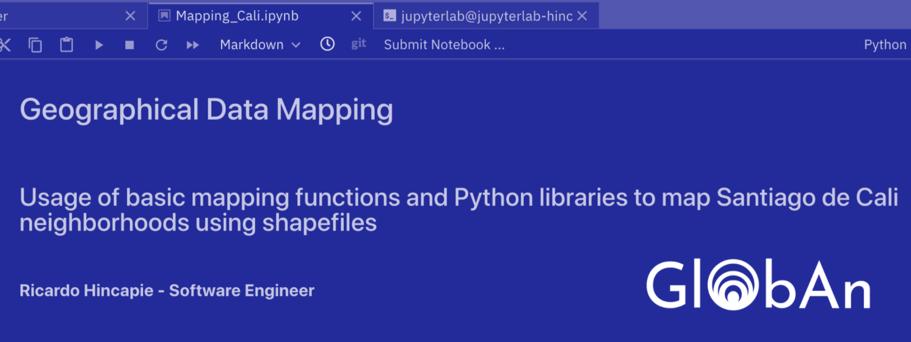
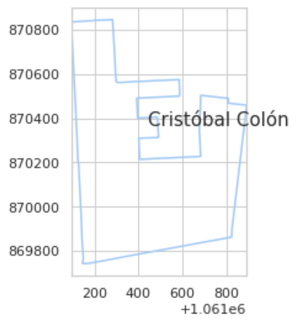
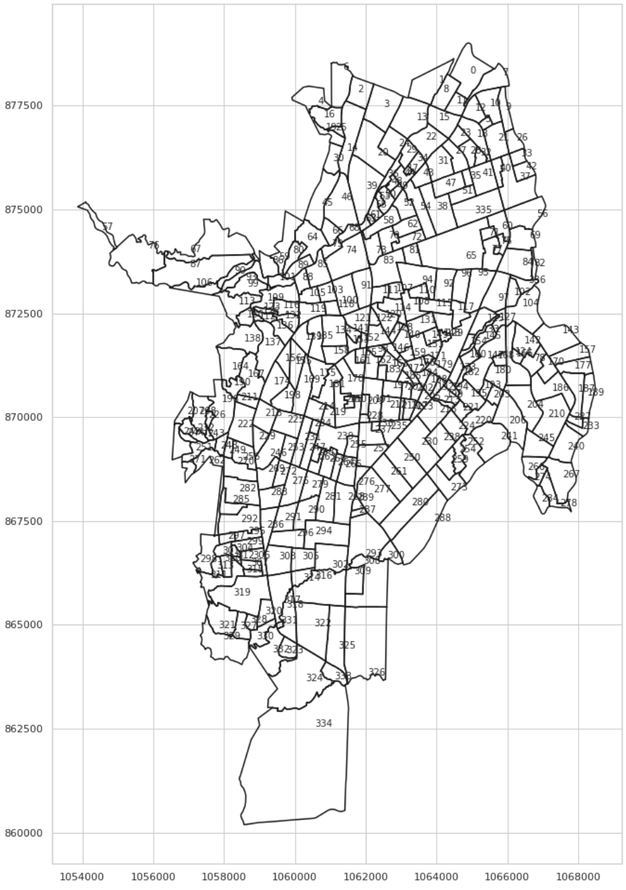

# GLOBAN MAPPING - Plotting maps based of shapefiles

This repository implements Python libraries and functions from Jupyter Notebooks to map Santiago de Cali's neighborgoods and plot open bid data on it for educational purposes.  

## Built With
* Python 3: Numpy - Pandas - Shapefile - Matplotlib - Seaborn
* Jupyter Notebook

## Examples

## Contributing
Open to contibuiting

## Authors
Ricardo Hincapie - Software Developer - [@RicarHincapie](https://www.linkedin.com/in/ricardohincapie/)
> :rocket: Let's follow each other on [Github](https://github.com/ricarhincapie)

## Acknowledgments
Thanks to [Marcelo Rovai](https://towardsdatascience.com/mapping-geograph-data-in-python-610a963d2d7f) for such a good guide into Data Science.
